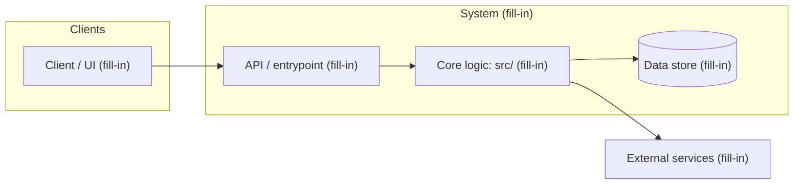
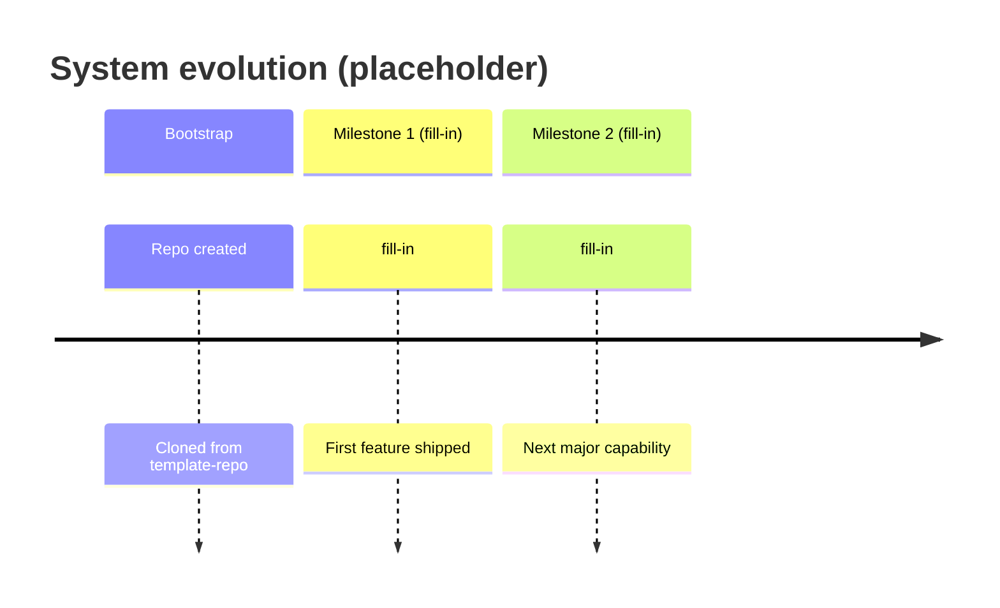

# System Diagram

> **Status:** Placeholder. Replace the `fill-in` nodes and events below as the architecture takes shape.

The living system diagram for this project, in two views:

1. **Graph view**: components and how they connect (structure).
2. **Timeline view**: how the system evolves over time (milestones).

Both are written in [Mermaid](https://mermaid.js.org/), so GitHub renders them inline; no image
files to regenerate. Update this document in the same PR as any change that alters the
architecture.

---

## Graph view

<!-- Replace the fill-in nodes with your real components; add or remove nodes and edges freely. -->

---

## Timeline view

<!-- Replace the fill-in milestones with real ones. If a sequence or gantt diagram fits your
     system better, swap the diagram type; keep the two-view structure (graph + time). -->

